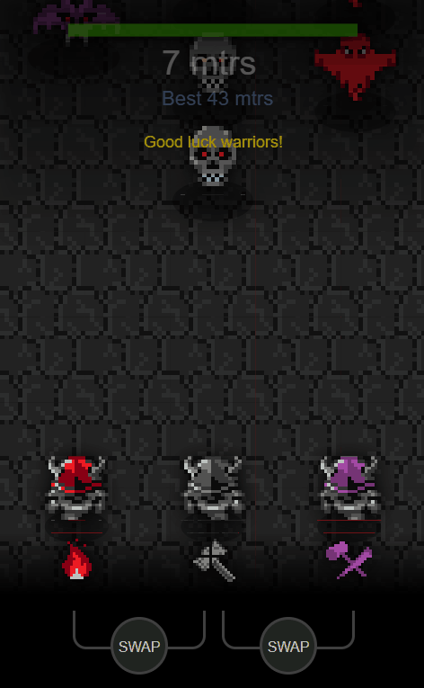
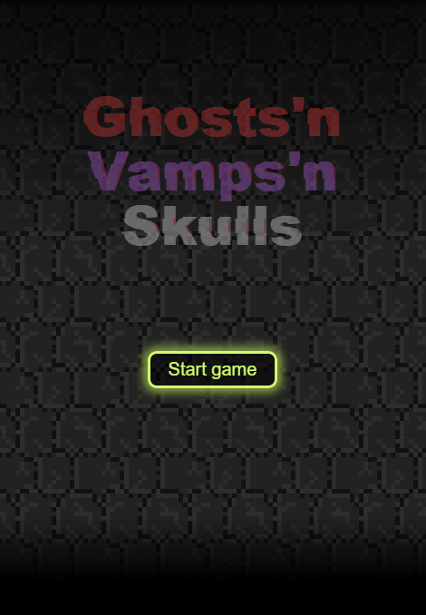

# 👻 Ghosts 'n' Vamps 'n' Skulls 💀

> **A retro arcade shooter built in < 13KB.** > Survive the undead night in this high-octane JS13K challenge entry.


---

<p align="center">
  
  <br>
  <b>Can you survive the graveyard?</b>
</p>

---

## 🎮 The Mission / La Misión

**[EN]** The graveyard has come to life. As the last survivor, you must face waves of ghosts, vampires, and skulls. No tutorials, no mercy—just pure arcade shooting.

**[ES]** El cementerio ha cobrado vida. Como último superviviente, deberás enfrentarte a oleadas de fantasmas, vampiros y calaveras. Sin tutoriales, sin piedad: solo disparos arcade puros.

---

## ✨ Features / Funcionalidades

| Feature / Función | Description / Descripción | Demo |
| :--- | :--- | :--- |
| **Intense Combat** | Fast-paced shooting and movement. / Disparos y movimiento frenético. |  |
| **Undead Variety** | Different AI patterns for every monster. / Patrones de IA distintos por monstruo. |  |
| **Retro Style** | 8-bit procedural graphics and audio. / Gráficos y audio procedural de 8 bits. |

---

## 🕹️ Controls / Controles

- ⌨️ **Arrows / WASD**: Move / Moverse
- 🖱️ **Left Click / Space**: Shoot / Disparar
- 🔄 **R**: Restart / Reiniciar

---

## 📦 Technical Breakdown (JS13K)

This project was developed for the **JS13KGames** competition. The entire game—code, assets, and sound—is compressed into a ZIP file of less than **13,312 bytes**.

- **Engine:** Vanilla JavaScript (No libraries).
- **Graphics:** Custom procedural sprite generator.
- **Audio:** Web Audio API (ZzFX).

---

## 🚀 How to Run / Cómo Ejecutar

1. **Clone the repository:**
   ```bash
   git clone [https://github.com/js13kGames/ghostsn-vampsn-skulls.git](https://github.com/js13kGames/ghostsn-vampsn-skulls.git)
